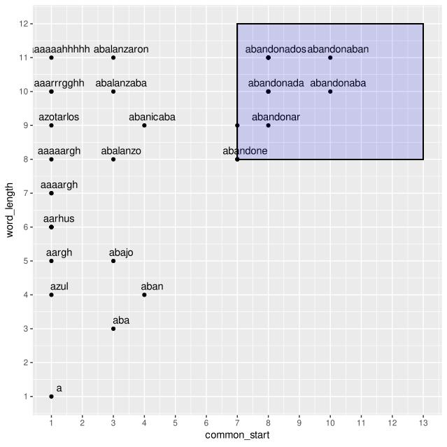

# Moogle!

> Proyecto de Programación I. 
> 
> Facultad de Matemática y Computación. 
> 
> Universidad de La Habana.  
> 
> Curso 2022. 
> 
> Alvaro Luis González Brito.

---

Este proyecto está dividido en dos grandes partes, el corpus y la query. El corpus contiene toda la información relevante de los documentos, así como funciones para extraer información de él, mientras que la query es la parte encargada de procesar la búsqueda introducida por el usuario, obtener la información necesaria del corpus, procesarla y determinar los resultados. 

---

## Algoritmos  Usados En El Proyecto:

- algoritmo de Levensthein: que permite determinar la edit_distance entre dos strings,  este es implementado usando una tabla y recursividad: 
  
  La edit_distance entre dos string no es más que la menor cantidad de operaciones de tipo insertar, reemplazar, borrar que hay que realizar a un string para transformarlo en otro, esto es lo que calcula el algoritmo de Levensthein, la idea es que podemos: a partir de tener la menor distancia para transformar un string en otro, obtener la distancia para transformar el string en el otro pero con un carácter más añadido delante, por ejemplo: $d("alv", "ax") = 2$, si deseamos transformar $"alv"$ en $"axr"$ podemos hacerlo a partir del resultado anterior, de ahí surge la idea de la tabla, calculamos el costo de realizar cada operación: insertar, reemplazar y eliminar, y nos quedamos con el menor.

- ¿DFS?: en el trie para a partir de un nodo del trie obtener todos los nodos hijos de él que constituyen palabras.  

- merge-k-sorted-lists: toma k listas ordenadas y las junta en una grande ordenada. Implementado de forma eficiente usando un heap (priority queue), la idea es asingnarle a cada palabra un id, de esta forma podemos distinguir las posiciones de dos palabras distintas, transformando las posiciones en tuplas, $(id-posiciones)$ , con esto hecho creo un heap, y pongo inicialmente en él, el primer elemento de cada lista, que es el menor, después voy extrayendo del heap el menor elemento, y verifico si de la lista a la que pertenecía este elemento le quedan elementos todavía, si le quedan insertar el primero al heap, y así hasta que no queden elementos. 

- min-interval: dado un array con algunos valores, obtener el menor subintervalo del array que contiene al menos una vez cada distinto valor del array original. Explicado en la sección del score por min-interval.

- min-window: dado un array con algunos valores, hallar el subintervalo de él de tamaño k que contiene la mayor cantidad de distintos valores de él. Esto es usado en el operador de cercanía, la idea es tener un diccionario que lleve la cuenta de las palabras y sus apariciones , entonces cada vez que recorremos una window(intervalo) actualizamos el diccionario y chequeamos si esta window es más pequeña.

- quick-sort: este es un algoritmo de ordenación bastante rápido que usa recursión. Posee una función llamada particionar que toma un valor de un intervalo del array, lo coloca en la posición correcta en este intervalo y pone a su izquierda los vaores menor que él y a su derecha los valores mayores que él.

## Base de Datos Del Corpus:

```csharp
public Dictionary<string, info_word_doc> bd; // the info is here.
```

Cada palabra encontrada entre los documentos constituye una entrada en este diccionario, y le asignamos un objeto de tipo *info_word_doc*, los componentes de este objeto son los siguientes:

```csharp
    public int idf; // store number of docs that contain this word
    public string linked; // store linked word
    public IEnumerable<string>? similar; // in case of being root store similar words
    public Dictionary<int, info_word> docs;  // store positions of this word in the docs.
```

Este objeto guarda la cantidad de documentos en los que aparece la palabra, la palabra raíz o sinónimos que le fue asignada, y en caso de la palabra ser raíz de otras palabras el conjunto de palabras de las cuales ella es raíz o sinónimo. También guarda un diccionario donde las entradas constituyen los índices de los documentos y los valores asociados a cada índice son un objeto de tipo *info__word_*, los componentes de este objeto son los siguientes:

```csharp
    public double weight;
    public List<int> pos; // it's essential that this list be sorted.
```

El peso asignado a esa palabra y las posiciones en ese documento donde aparece la palabra, como parte de las optimizaciones de el corpus para obtener la información obtenida en él esta lista de posiciones es ordenada de menor a mayor. 

### El proceso de rellenar toda la información en este diccionario es decrito a continuación con cada parte por separado:

#### Cache y Carga De Documentos:

Lo primero que se realiza es cargar los documentos en memoria, usando una estructura llamada *doc*, los componentes de este objeto son los siguientes:

```csharp
    public int id; // id of the document
    public string name; // name of the document to return to the snippet
    public string text; // the text of the document
    public string path; // the path where it is
```

Después de haber obtenido la información anterior se calcula el *SHA256* (un hash) de cada texto de cada documento, en la carpeta cache un "hashes.txt" contiene hashes calculados anteriormente, en base a esta información y los nuevos hashes determino si ha habido algún cambio en la carpeta que contiene los documentos, si un hash ya se encontraba en "hashes.txt" esto significa que este documento ya fue analizado/cacheado, así que busco su información en la carpeta cache, en caso contrario obtengo toda su información, la guardo en la carpeta cache y añado su hash a el archivo "hashes.txt". El hecho de haber algúna diferencia entre los hashes calculados y los existentes en "hashes.txt" me indica que hubo un cambio en la carpeta de la base de datos y por tanto el algoritmo de *stemming* debe ejecutarse.

#### Describo el proceso de obtener la información de un documento en caso de que no haya sido cacheado anteriormente:

Se lee el texto del documento carácter por carácter, cada vez que encuentra un intervalo de carácteres que son alfanúmericos (letras o dígitos), intenta añadir la palabra al diccionario grande, general, actualiza su idf y actualiza su peso y guarda en la lista de posiciones la posición donde aparece la palabra. En fin después de hacer este recorrido cada palabra en el documento fue añadida al diccionario general, aumentado en 1 su idf, y en el objeto que contiene la información relevante a esta palabra en el documento se encuentra la cantidad de veces que aparece esta palabra en el documento y una lista con todas las posiciones donde apareció la palabra. Esta información es guardada en dos .json diferentes uno para las posiciones y otro para las palabras.

#### En el punto en el que todos los documentos han sido procesados:

##### Asignar peso a las palabras:

Utilizaré finalmente como peso de la palabra en el documento la fórmula tf-idf, donde:

- tf: cantidad de apariciones de la palabra en el documento dividido entre la cantidad de palabras en el documento.

- idf: cantidad de documentos en los que aparece la palabra.

El peso final de la palabra es $tf x \log(\frac{cantdocs}{idf+1})$, usaré esta fórmula para darle un peso a las palabras en cada documento.

##### Asignar una raíz a las palabras:

Utilizando el archivo similar_words.json generado por el stemmer, a cada palabra le asigno su raíz (linked_word) y a las palabras que son raíces sus similares.

##### Sinónimos:

Utilizando una archivo de sinónimos a las palabras que son sinónimos, las hago apuntar hacia la misma raíz o sea si dos palabras son sinónimos sus respectivas linked_word deberían coincidir y el valor en el que coinciden (palabra raíz) contiene como similares a todos los sinónimos respecto a esa palabra.

##### Conclusión:

Si es determinado que dos palabras son similares por algún motivo ellas deben tener la misma linked_word, finalmente ejecuto un algoritmo que a cada palabra que es raíz le asigno sus similares en un objeto *IEnumerable* porque solamente necesito recorrer esta lista.

#### Stemming Process:



Stem es el proceso de hallarle la raíz a una palabra, basado en que las palabras de la misma raíz poseen un comienzo en común y longitud en cierto rango decidí implementar un algoritmo de Stemming, lo más importantes es que este algoritmo toma como argumento un array de strings y devuelve un diccionario donde a cada uno de estos strings le asigno algún string perteneciente a ellos, de esta forma si alguien desea cambiar el stemmer solamente tiene que cambiar la forma en que a cada string le es determinado el string que se le asignará siempre y cuando se cumplan las siguientes condiciones:

- a cada string le es asociado otro string y cada string asociado pertenece a el array tomado.

Para realizar el stem, ordené las palabras lexicográficamente, para cada *palabra* (razón por la que se demora tanto) ejecuto lo siguiente determino un conjunto de palabras cercanas a ella (las que están dentro del rectángulo azul en la imagen, basado en que tan largo  es la raíz que tienen en común y su longitud), teniendo este conjunto de palabras determino su parte común y chequeo si sus terminaciones corresponden con las terminaciones de las palabras derivadas del español, en caso afirmativo emparejo todas estas palabras con la *palabra* y las remuevo del array, al acabarse este proceso las palabras que no fueron emparejadas por no cumplir las condiciones son emparejadas con si mismas, de esta forma cada palabra es emparejada, haciendo este proceso tengo en cuenta el plural de las palabras y terminaciones comunes de adverbios como "mente".

#### A grandes rasgos en esto consiste la información de los documentos y las palabras:

cada palabra del corpus tiene un idf, una palabra asociada a ella y en caso de ser raíz las palabras similares a ella, y un diccionario que contiene su peso y las posiciones en las que aparece en cada documento.

### Algoritmos Para Extraer Información Del Corpus:

En esta sección describo como es el proceso de obtener información del corpus, mi objetivo es que el corpus funcione como una base de datos con cierta información y que toda la información que sea necesaria guardada en él pueda ser obtenida lo más eficiente posible, también ahorrar lo más posible en memoria RAM.

```csharp
public bool word_is_popular(string word, double factor)
public double request_word_idf(string word, bool allow_similar)
public bool word_in_corpus(string word)
public double request_word_weight(string word, int id, bool allow_similar = false)
public List<int> request_word_positions(string word, int id, bool allow_similar = false)
```

- decide si una palabra es popular entre los documentos, lo es si aparece màs de 100 (por ejemplo) veces en cierta cantidad de documentos determinada por el factor.

- devuelve el idf de la palabra, en caso de que se puedan utilizar las palabras similares a ella devuelve el promedio.

- decide si la palabra está en el corpus.

- devuelve el peso asignado a la palabra word en el documento identificado por id, en caso de que se pueda utilizar las similares devuelve el promedio entre todas las similares.

- devuelve las posiciones en las que aparece la palabra word en el documento identificado por id, es interesante el caso en que es pedido también las posiciones donde aparecen las palabras similares a ella, se realiza lo siguiente dado que la lista de posiciones de cada palabra similar está ordenada se realiza un algorimo conocido como merge-k-sorted-list y se devuelve el resultado de este algoritmo.

### Otras funcionalidades del corpus:

#### Trie:

Un trie es una estructura de datos útil para gestionar prefijos de palabras, esta estructura es implementada con el objetivo de realizar autocompletado en las palabras ya que esta permite en tiempo relativamente rápido obtener dado un prefijo las palabras que comienzan con este prefijo.

### Levensthein Algorithm:

Para realizar sugerencias basadas en palabras que son cercanas (útil para problemas ortográficos) es necesario tener a mano las palabras del corpus ordenadas por el tamaño de la palabra y donde empiezan las palabras de tamaño $k$, esta información es guardada en el corpus también.

## Query:

### Scorers:

Con el objetivo de determinar los resultados implementé tres funciones para determinar cuales son los mejores documentos. A partir del score de cada documento en cada categoría es determinada su posición final.

#### Modelo Vectorial: TF-IDF

Este score es basado en la implementación de un modelo vectorial: las dimensiones de este son las palabras de la query y el valor es el peso asociado a cada palabra, de esta forma después de solicitar al corpus el tf-idf de cada palabra podemos interpretar  cada documento y la query como un vector, entonces para cada documento calculamos el coseno del ángulo que forma con la query, el coseno de este ángulo es obtenido al dividir el dot product de los dos vectores entre el producto de sus normas. El documento para el cual su coseno es mayor, indica que el ángulo es menor y por tanto es más similar a la query, esta es la idea de este scorer. Debido a que los resultados del tf-idf pueden ser muy cercanos y diferenciarse en 0.0001, decidí dividir todos los resultados obtenidos por el mayor score, de esta forma consideré más apreciable los resultados.

#### Cercanía:

Dado un documento y una lista de grupos de palabras a encontrar cerca, voy a devolver la cantidad de palabras encontradas cerca aumentado en el recíproco de la longitud del menor intervalo de tamaño a lo más $diámetro$ que contiene las palabras encontradas, o sea, para cada grupo de palabras a buscar cercanas, cuento la cantidad de palabras que de ellas que puedo encontrar en el documento a una intervalo de tamaño a lo más diámetro y a esto le sumo el reciproco de la longitud de el intervalo encontrado pero reducido lo más posible utilizando el algoritmo de min-interval, esta es la idea respecto a el operador de cercanía, este está implementado de la siguiente forma:

- obtener una lista ordenada por las posiciones donde se encuentran todas las palabras a buscar cercancamente, haciendo un merge-k-sorted-list en las palabras cercanas.

- recorrer todos los subintervalos de tamaño diámetro, usando un diccionario que lleva la cuenta de la cantidad de palabras que hay en el intervalo y sus apariciones, cada vez que avanzamos y cambiamos de intervalo actualizamos el diccionario y comprobamos si tenemos un mejor intervalo. Con el intervalo que es determinado como mejor debido a ser el de menor tamaño y mayor cantidad de palabras cercanas le aplico el algoritmo de *min-interval* para reducirlo lo más posible.

La idea de devolver el inverso del recíproco de la longitud del intervalo es que a medida que la longitud del intervalo decrece, aumenta esta cantidad, y así uso esta medida para entre dos documentos o intervalos con las mismas cantidad de palabras determinar cual es el mejor a partir de su longitud reducida lo más posible.

#### Min Interval:

Para cada documento hallar la longitud del menor intervalo que contiene la mayor cantidad de palabras posible de la query, o sea, si el documento contiene $x$ palabras de la query hallar el menor intervalo del documento que contiene estas $x$ palabras, devolver $x$ + reciproco de la longitud del intervalo. La idea de este scorer  es que es posible que el tf-idf nos muestre un documento que contiene bastantes apariciones de las palabras de la query, pero que no tengan nada que ver, este scorer constituye un medidor de que tan cercanas están estas palabras.

La idea de su implementación es primero obtener todas las posiciones de las palabras y a través de un merge-k-sorted list unirlas en una grande ordenada, en este punto lo siguiente sería:

1. empezar con un intervalo inicial que sería desde la menor posición hasta la mayor posición.

2. siempre llevamos un diccionario con la cuenta de las palabras que están en el intervalo *start, end* donde nos encontramos y su cantidad de apariciones.

3. usamos dos pointers que indican el intervalo donde estamos: *start*, *end*: para cada distinto valor que pueda tomar *end* (de 0 a (longitud de la lista -1))  si encontramos un intervalo relevante, entonces tratamos de achicar *start*, y comprobamos si es más pequeño que el intervalo anterior, en otras palabras para cada *end* hallamos el mayor *start* tal que ambos determinan un intervalo con todas las palabras.

4. una observación de este algoritmo es que el *start* no disminuye  cuando cambia el *end* , es posible que aumente pero no que disminuye, porque dado un intervalo, que funciona como candidato entonces si le aumentamos su end en $1$ seguirá siendo candidato, y lo único que puede ser posible es que aumente el *start*, en particular la complejidad del algoritmo no es cuadrática.  
   
   ## Medals:

Cada uno de los tres scorers me dará una puntuación respecto a cada documento, con el objetivo de interpretar y mezclar estos resultados implemento este procedure, en base a ciertos criterios para cada scorer, a cada documento le asocio medallas en cada categoría, finalmente decido cuanto vale cada medalla en cada categoría, esto determina la posición final de los documentos.

```csharp
            if (score_by_tfidf[i] > 0.85)
            {
                medallas[i][0] = cons.constants["medalla_oro_tf_idf"];

            }
            if ((score_by_cercania[i] >= cercania_max_words) && score_by_cercania[i] >= 0.67*this.closest_words.Count )
            {
                medallas[i][1] = cons.constants["medalla_oro_cercania"] + (score_by_cercania[i]- Math.Floor(score_by_cercania[i]));
            }
            if ( (score_by_min_interval[i] >= min_interval_max_words) &&  ( ( score_by_cercania[i]- min_interval_max_words) > 0.001)  && score_by_min_interval[i] > 0.6*this.words_to_request.Count )
            {
                medallas[i][2] = cons.constants["medalla_oro_min_interval"] + (score_by_min_interval[i]- Math.Floor(score_by_min_interval[i]));
            }
```

El código anterior representa los criterios que debe cumplir un score para obtener la medalla de oro en cada categoría. Análogamente hay criterios para cada categoría.

### Snippet:

Creé un objeto de tipo snippet para cada documento, este está compuesto por:

- un diccionario que lleva la cuenta de las palabras que ya se encuentran en un intervalo del snippet y las que no.

- una lista donde se guardan todos los intervalos relevantes.

- y un grupo de posiciones de respuesto en caso de no haber encontrado algún intervalo pequeño que contenga las palabras.

```csharp
        this.already_words = new Dictionary<int, bool>();
        this.positions = new List<Tuple<int, int>>();
        this.respuesto = new Dictionary<int, int>();
```

 Para añadir intervalos relevantes uso el siguiente sencillo método *Add*:

```csharp
    public void add_(Tuple<int, int> A, List<int> ids)
    {
        this.positions.Add(A);
        foreach (var item in ids)
        {
            already_words[item] = true;
        }
    }
```

Este añade a la lista de posiciones un intervalo $A$, y actualiza la información de las palabras contenidas en ese intervalo, también finalmente el snippet posee un método *fill* que utilizará las posiciones de respuesto para completar la query. Finalmente antes de hacer el snippet remuevo los intervalos repetidos o contenidos en otros intervalos. Esto es una idea de lo que hace el snippet internamente. 

Por otro lado cuando se ejecuta el operador de cercanía si hay algún resultado relevante como un intervalo pequeño con varias palabras, este es añadido a los intervalos relevantes del snippet, después si en el min-intervalo scorer hay algún intervalo relevante también es añadido a los intervalos relevantes, finalmente se añaden las posiciones de respuesto en caso de no haber intervalos usando las posiciones suministradas de argumento al scorer de min-interval.

### Parse The Query:

La query es un string que a diferencia de el string de los documentos contiene operadores, debido a esto el objeto query posee todos estas propiedades:

```csharp
    string q; // the query
    public Dictionary<string, int> words; // words in the query with its id.
    List<string[]> op_cerc; // words that are related by ~.
    HashSet<string> only_words; // words that have to be forced.
    HashSet<string> forbidden_words; // words that can't be.
    Dictionary<string, int> boosted_words; // words that have more priority.
    HashSet<string> similar_words; // words that we can find its similar and sinonyms.
    HashSet<string> common_words; // words that will be ignored becuase are so common.
    Dictionary<string, double> tfidf; // tf-idf words in the query.
    public HashSet<string> closest_words; // ignore word that are affected by at least one operator of cercania
    public HashSet<string> words_to_request; // words that are not ignored and allowed. 
    public double[] score_by_tfidf;
    public double[] score_by_cercania;
    public double[] score_by_min_interval;
    public Dictionary<int, List<id_element<int>>> relevant_info;

    public Dictionary<int, double[]> medallas;
    public snippet[] the_snippets;
    public List<string> words_to_suggest;
    public Tuple<int, string,string,string>[] best_docs;
    double norm;
```

La estructura *HashSet* la usé debido a que los Hashes son eficientes a la hora de hacer métodos como *Contains*

- Para interpretar la query, la leo en busca de palabras, cada vez que encuentro una palabra leo los carácteres delante de ella y añado sus operadores a excepción del     \~ 

- Después elimino de la query los espacios y los operadores excepto el de cercanía y ahora vuelvo a recorrer la query en busca de las palabras relacionadas por la cercanía.

- A cada palabra de la query le asigno un id, entonces un objeto de tipo *id_element<T>* es un objeto que posee un id que es un entero y su información de tipo T.

- Después de parsear a query filtro los documentos debido a los operadores de ^!.

- El tfidf de las palabras en la query  afectadas por \* lo aumento al multiplicarlas por $10$ elevado a la cantidad de \* +1 de la paabra.

- Desecho las palabras de la query que son populares entre los documentos pero que no son afectadas por los otros operadores, y finalmente me quedo con una lista de palabras que son con las que trabajaré, aquellas que no aparecen en el corpus las dejo en la categoría sugerencias.

- Ahora llamo a la función de asignar scorers, en su ejecución completará el snippet, y finalemente la de las medallas, esto decide los mejores documentos y se lo comunica a Moogle para enseñar la información relevante de estos.

## Constants:

Con el objetivo de que el usuario pueda definir y variar algunas constantes del Moogle cree un config.json, debido a que los valores de las constantes fueron las que consideré adecuadas, pero esto puede no ser lo más óptimo para otro usuario, por tanto implementé una versión de valores por defecto,  en caso de que el usuario desee modificar estos valores es libre de hacerlo.