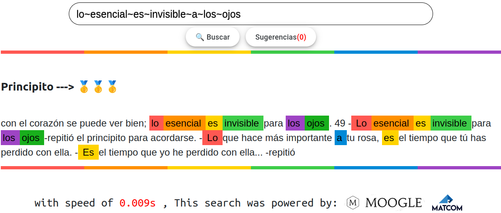

# Moogle!



> Proyecto de Programación I. Facultad de Matemática y Computación. Universidad de La Habana. Curso 2021.

Moogle! es una aplicación *totalmente original* cuyo propósito es buscar inteligentemente un texto en un conjunto de documentos.

Es una aplicación web, desarrollada con tecnología .NET Core 6.0, específicamente usando Blazor como *framework* web para la interfaz gráfica, y en el lenguaje C#.

## Requisitos y como ejecutarlo:

Necesitas tener instalado algún navegador y tener disponible a dotnet en tu path, o equivalente a esto tener NET CORE 6.0 instalado, para ejecutarlo te debes parar en la carpeta del proyecto y ejecutar en la terminal de Linux:

```bash
make dev
```

Si estás en Windows, debes poder hacer lo mismo desde la terminal del WSL (Windows Subsystem for Linux). Si no tienes WSL ni posibilidad de instalarlo, deberías considerar seriamente instalar Linux, pero si de todas formas te empeñas en desarrollar el proyecto en Windows, el comando *ultimate* para ejecutar la aplicación es (desde la carpeta raíz del proyecto):

```bash
dotnet watch run --project MoogleServer
```

En la carpeta (raíz del proyecto)/Content  o (./Content) debes poner los .txt que vas a utilizar como base de datos, cada vez que haces un cambio en la carpeta ./Content el Moogle lo determinará y ejecutará el stemmer (lo que le halla la raíz a las palabras basado en probabilidad)  (es lento <5 min>, so no te preocupes porque se demore cargando), por suerte esto ocurre la primera vez que se carga el Moogle con la nuvea base de datos, después no se ejecutará porque usará cache y será rápido.

## Instrucciones para usarlo:

- cuando vayas escribiendo una palabra en la barra de búsqueda aparecerá en el fondo una sugerencia, si aprietas la flecha arriba del teclado se autocompleta la palabra.

- si añades ^ delante de una palabra está palabra ha de aparecer en todos los documentos  resultantes, mientras que si añades ! delante de una palabra está no puede aparecer en ningún documento resultante.

- si por alguna razón deseas añadirle más prioridad a alguna palabra de tu búsqueda puedes añadirle signos * al comienzo, mientras más, más prioridad.

- si necesitas buscar alguna frase textualmente,puedes poner el símbolo ~ entre dos o más palabras, esto hará que mientras más cercanas estén más relevante será el resultado.

- finalmente si tienes  verbo y no estás seguro de que conjugación buscar, o que pueda aparecer un sinónimo de la palabra puedes añadir ¿ delante de la palabra, esto buscará sinónimos de esta palabra y palabras con su misma raíz, por ejemplo: vaciló vacilante etc.

- palabras muy comunes en los documentos serán ignoradas como lo, el, etc, si deseas forzozamente buscar por ella o es el caso de que para tu base de datos la palabra que buscas resulta ser ignorada  considera insertarle ~ al comienzo de la palabra, esto garantizará que no sea ignorada debido a ser muy común.

## Ejemplos de query:

1. **esencial\~invisible\~ojos

2. *¿*esencial\~invisible ojos principito\~dijo

3. ~ojos
